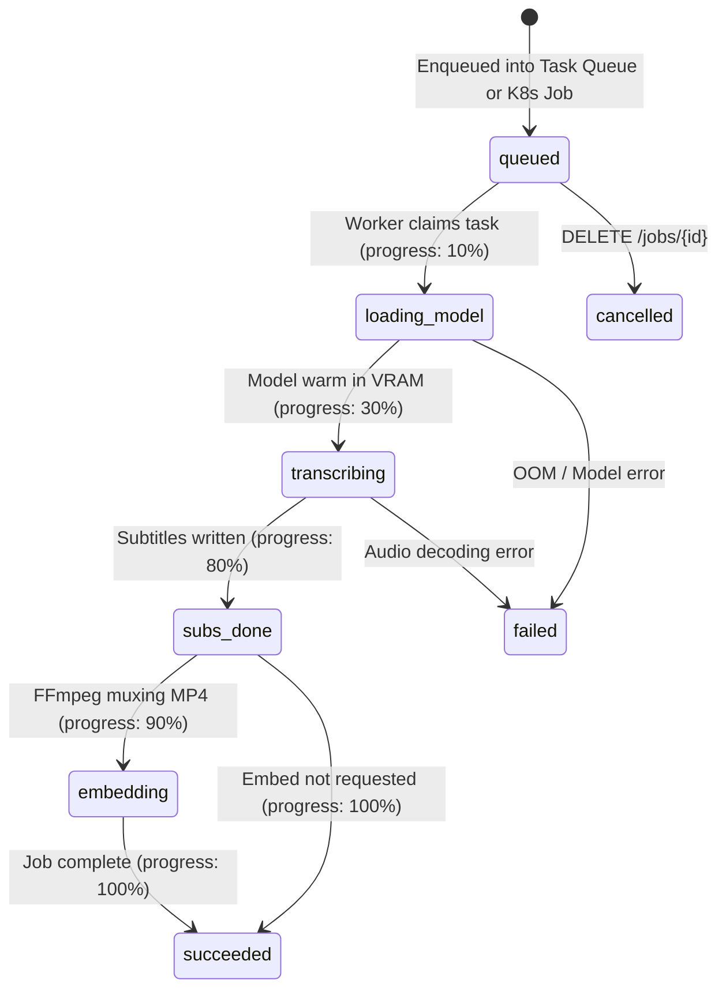

# REST API & Webhooks Reference

This document provides exhaustive documentation of all HTTP endpoints exposed by the `whisper-k8s` API bridge, including payload schemas, request parameters, response models, Prometheus metrics, and push webhook configurations.

---

## 1. Overview & Base URL

The API Bridge is a FastAPI application running inside the Kubernetes cluster.
- **Default Port**: `8080` (configurable via `PORT`).
- **Cluster In-DNS**: `http://whisper-bridge.whisper.svc.cluster.local:8080`
- **Default Media Type**: `application/json` (except `/metrics` and `/download`).

---

## 2. API Endpoints

### A. Health & Readiness Probe
`GET /health`

Used by Kubernetes liveness and readiness probes to confirm bridge availability.

#### Response (200 OK)
```json
{
  "ok": true,
  "namespace": "whisper",
  "kube": "incluster"
}
```

---

### B. Submit Transcription Job
`POST /jobs`

Submits a new transcription or translation task. Depending on `mode`, this immediately enqueues the task into the warm worker pool (`mode="pool"`) or creates a Kubernetes batch Job (`mode="pod"`).

#### Request Body (`CreateJobReq`)

| Parameter | Type | Required | Default | Description |
| :--- | :--- | :---: | :--- | :--- |
| `filename` | string | Optional* | `null` | Filename of the media file inside `/data/videos` on the shared PVC. |
| `trackUrl` | string | Optional* | `null` | Remote HTTP/HTTPS URL. The bridge downloads the media safely into `/data/videos` before processing. |
| `mode` | string | No | `pod` | Execution mode: `pool` (warm worker pool), `pod` (ephemeral K8s Job), or `ssh` (remote host proxy). |
| `backend` | string | No | `whisper` | Inference engine: `faster-whisper`, `whisper`, or `whisper.cpp`. |
| `model` | string | No | `base` | Whisper model size: `tiny`, `base`, `small`, `medium`, `large-v1`, `large-v2`, `large-v3`. |
| `format` | string | No | `srt` | Subtitle output format: `srt` or `vtt`. |
| `device` | string | No | `gpu` | Target device: `gpu` (mapped to CUDA) or `cpu`. |
| `embed` | boolean | No | `false` | Whether to mux subtitles into an MP4 video (`<name>.embedded.mp4`). |
| `language` | string | No | `null` | Two-letter ISO language code (e.g. `en`, `de`, `fr`). If omitted, Whisper auto-detects. |
| `task` | string | No | `transcribe`| `transcribe` (keep source language) or `translate` (translate speech to English). |
| `computeType`| string | No | `null` | Quantization for `faster-whisper`: `int8_float16`, `float16`, `int8`, `float32`. |
| `vramFraction`| float | No | `null` | Fractional GPU VRAM limit (0.01 to 1.0) for GPU time-slicing protection. |
| `enableChunking`| bool | No | `null` | Force enable P4 VAD silence audio chunking. |
| `parallelChunks`| int | No | `1` | Number of parallel worker slices for chunked transcription (1 to 16). |
| `chunkDurationSec`| int | No | `600` | Target audio slice duration in seconds (minimum 30s). |
| `overwrite` | boolean | No | `null` | Whether to recompute existing outputs (`true` forces recomputation). |
| `outputDir` | string | No | `null` | Subdirectory under `/data` to copy final outputs upon completion. |
| `cleanup` | boolean | No | `false` | If `true`, deletes source input media and temporary files after completion. |
| `callbackUrl` | string | No | `null` | Remote HTTP/HTTPS webhook URL to notify upon job completion or failure. |
| `callbackHeaders`| object | No | `null` | Custom HTTP headers sent with the webhook (e.g. `{"Authorization": "Bearer token"}`). |

*\* Note: Either `filename` or `trackUrl` must be specified.*

#### Example 1: Immediate Warm Worker Pool Submission with Push Webhook
```bash
curl -X POST http://localhost:8080/jobs \
  -H "Content-Type: application/json" \
  -d '{
    "filename": "lecture_01.mp4",
    "mode": "pool",
    "backend": "faster-whisper",
    "model": "base",
    "format": "vtt",
    "embed": true,
    "callbackUrl": "https://api.example.com/whisper-callback",
    "callbackHeaders": {
      "Authorization": "Bearer secret-token-xyz"
    }
  }'
```

#### Example 2: Long Audio with P4 Parallel VAD Chunking
```bash
curl -X POST http://localhost:8080/jobs \
  -H "Content-Type: application/json" \
  -d '{
    "trackUrl": "https://media.example.com/long_keynote.mp4",
    "mode": "pool",
    "backend": "faster-whisper",
    "model": "medium",
    "computeType": "int8_float16",
    "vramFraction": 0.25,
    "enableChunking": true,
    "parallelChunks": 4,
    "chunkDurationSec": 600
  }'
```

#### Response (`CreateJobResp`) - HTTP 200 OK
```json
{
  "jobId": "8f96e451b68e434f9520e54ff29e1eb1",
  "status": "accepted",
  "videoPath": "/data/videos/lecture_01.mp4",
  "namespace": "whisper"
}
```

---

### C. Check Job Status
`GET /status/{job_id}`

Retrieves the real-time execution status of a previously submitted job. Inspects Kubernetes Job conditions as well as real-time status records on disk (`/data/subs/{job_id}.status.json`), ensuring full state recovery even after Kubernetes cleans up finished pods via TTL.

#### Path Parameters
- `job_id` (string, required): The UUID returned by `POST /jobs`.

#### Response (`JobStatusResp`) - HTTP 200 OK
```json
{
  "status": "succeeded",
  "progress": 100,
  "subtitlePath": "/data/subs/lecture_01.vtt",
  "flavor": "vtt+embedded",
  "message": "Job finished successfully"
}
```

#### Lifecycle Phase Diagram


---

### D. Download Job Output
`GET /jobs/{job_id}/download`

Directly downloads the generated output artifacts for a finished job.

#### Query Parameters
- `format` (string, optional):
  - Omitted: Downloads the external subtitle file (`.vtt` or `.srt`).
  - `format=embedded`: Downloads the re-muxed video with hardcoded subtitles (`.embedded.mp4`).

#### Responses
- **200 OK**: Streams file with appropriate MIME headers (`text/vtt`, `application/x-subrip`, or `video/mp4`).
- **404 Not Found**: If the job outputs do not exist or have not completed.

#### Example
```bash
# Download subtitles
curl http://localhost:8080/jobs/8f96e451b68e434f9520e54ff29e1eb1/download -o subs.vtt

# Download embedded video
curl http://localhost:8080/jobs/8f96e451b68e434f9520e54ff29e1eb1/download?format=embedded -o video.embedded.mp4
```

---

### E. Cancel Job
`DELETE /jobs/{job_id}`

Cancels an active or queued job.
1. If running as a Kubernetes batch `Job`, deletes the Job and its pods immediately.
2. If waiting in the warm worker pool (`FileTaskQueue`), removes the task `.json` from `/data/queue/pending/`.
3. Marks `/data/subs/{job_id}.status.json` as `cancelled`.
4. Increments the `whisper_jobs_total{status="cancelled"}` Prometheus counter.

#### Response (200 OK)
```json
{
  "ok": true,
  "jobId": "8f96e451b68e434f9520e54ff29e1eb1",
  "message": "Job cancelled successfully"
}
```

---

### F. Prometheus Metrics Exposition
`GET /metrics`

Exposes real-time telemetry conforming to the official Prometheus 0.0.4 text specification (`text/plain; version=0.0.4; charset=utf-8`).

#### Exposed Metrics

| Metric Name | Type | Labels | Description |
| :--- | :--- | :--- | :--- |
| `whisper_jobs_total` | Counter | `status`, `mode` | Total jobs by outcome (`submitted`, `succeeded`, `failed`, `cancelled`) and mode (`pool`, `pod`, `ssh`). |
| `whisper_queue_depth` | Gauge | `queue` | Instantaneous task backlog dynamically evaluated at scrape time (`pending`, `processing`, `completed`). |
| `whisper_active_workers` | Gauge | `service` | Number of active worker daemons processing jobs (`pool_worker`). |
| `whisper_model_cache_events_total`| Counter | `event`, `model`, `backend` | In-memory model cache lookups (`hit` vs. `miss`). |
| `whisper_job_duration_seconds` | Histogram | `mode` | End-to-end processing duration histogram with buckets `[5, 15, 30, 60, 120, 300, 600, 1800]`. |
| `whisper_webhooks_dispatched_total`| Counter| `status` | Webhook delivery notifications by outcome (`success` vs. `failure`). |

#### Sample Scrape Output
```text
# HELP whisper_queue_depth Instantaneous count of transcription tasks across queue states
# TYPE whisper_queue_depth gauge
whisper_queue_depth{queue="completed"} 42.0
whisper_queue_depth{queue="pending"} 2.0
whisper_queue_depth{queue="processing"} 1.0

# HELP whisper_jobs_total Total submitted transcription jobs across execution modes and terminal statuses
# TYPE whisper_jobs_total counter
whisper_jobs_total{mode="pool",status="submitted"} 45.0
whisper_jobs_total{mode="pool",status="succeeded"} 42.0

# HELP whisper_model_cache_events_total In-memory Whisper model cache lookup events (hits and misses)
# TYPE whisper_model_cache_events_total counter
whisper_model_cache_events_total{backend="faster-whisper",event="hit",model="base"} 40.0
whisper_model_cache_events_total{backend="faster-whisper",event="miss",model="base"} 2.0
```

---

## 3. Push Webhook Specification

When `callbackUrl` is provided in `POST /jobs`, the worker automatically dispatches an HTTP POST request upon task completion or failure.

### Webhook Payload Schema
```json
{
  "jobId": "8f96e451b68e434f9520e54ff29e1eb1",
  "status": "succeeded",
  "subtitlePath": "/data/subs/lecture_01.vtt",
  "flavor": "vtt+embedded",
  "progress": 100,
  "error": null
}
```

### SSRF Protection Policy
To prevent Server-Side Request Forgery (SSRF) and data leakage, `app/webhook.py` resolves the target hostname and blocks:
- Loopback addresses (`127.0.0.1`, `localhost`, `::1`).
- Private RFC1918 ranges (`10.0.0.0/8`, `172.16.0.0/12`, `192.168.0.0/16`).
- Link-local and multicast addresses (`169.254.0.0/16`, `224.0.0.0/4`).
- Cloud instance metadata services (`169.254.169.254`).
- *Local Development Override*: Set `ALLOW_LOCAL_URLS=true` to permit loopback callbacks in offline testing.

### Delivery & Retry Policy
- Dispatches using HTTP `POST` with `Content-Type: application/json` and `User-Agent: whisper-k8s-webhook/1.0`.
- **Exponential Backoff**: Up to 3 attempts with initial delay of 1.0 second (doubling each retry: 1.0s, 2.0s, 4.0s).
- **Client Error Behavior**: Immediately aborts without retrying on HTTP 4xx client errors (e.g. 401 Unauthorized, 404 Not Found).
