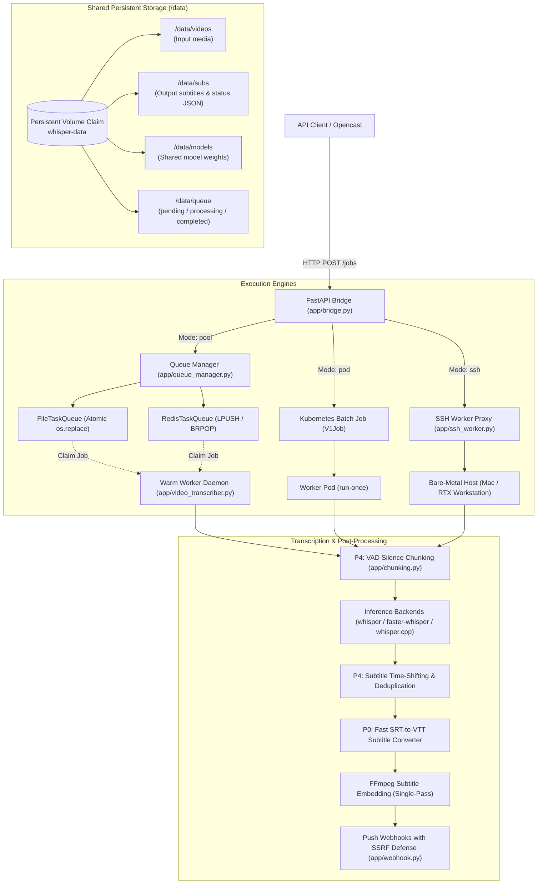
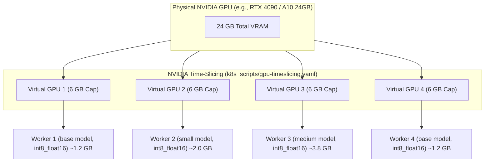
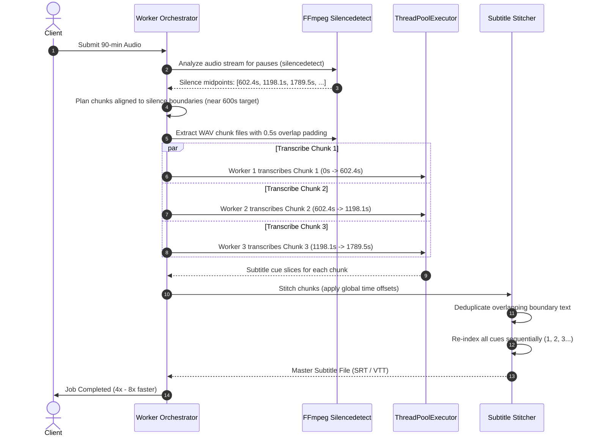

# System Architecture & Internals

This document provides a comprehensive technical breakdown of the architecture, subsystems, and optimization mechanics powering `whisper-k8s`.

---

## 1. High-Level Subsystem Architecture

`whisper-k8s` decouples API request handling, task queuing, and compute-heavy speech-to-text inference across modular layers:



---

## 2. The Three Execution Modes

`whisper-k8s` supports three execution modes selected per-request (`mode` parameter in `CreateJobReq`) or globally via `EXECUTION_MODE`:

### A. Warm Worker Pool (`mode="pool"`) - *Recommended*
- **Problem Solved**: Ephemeral Kubernetes Jobs incur container image scheduling, pod sandbox initialization, volume mounting, and Python process startup latency (~15–30 seconds per job).
- **Architecture**:
  - The Bridge writes the task spec directly to the queue and responds with an HTTP 200 `jobId` in **$<10\text{ms}$**.
  - A persistent Deployment (`whisper-worker-pool`) runs daemon workers (`SERVICE=pool_worker`) polling the queue.
  - **In-Memory Model Cache (`model_cache`)**: Once loaded, Whisper models remain resident in GPU VRAM across consecutive tasks. A 1-hour lecture submitted immediately after another reuses the warm model, eliminating the 5–15 second model weight reload.
  - **Autoscaling**: Scaled from 0 up to 8 pods elastically by KEDA based on queue backlog.

### B. Ephemeral Batch Pod (`mode="pod"` / `mode="kubernetes"`)
- **Architecture**:
  - The Bridge constructs a Kubernetes `V1Job` resource with explicit resource limits (`nvidia.com/gpu: "1"`, CPU, Memory) and submits it to the Kubernetes Batch API.
  - The worker pod executes a single job to completion and terminates.
  - Job results are persisted to `/data/subs`, and the Kubernetes Job is automatically cleaned up after 1 hour via `ttl_seconds_after_finished=3600`.
- **Best Suited For**: Multi-tenant clusters requiring hard resource isolation between jobs or strict namespace quotas.

### C. Bare-Metal SSH Proxy (`mode="ssh"`)
- **Architecture**:
  - When Kubernetes cluster nodes lack GPUs, the bridge can execute inference on an external host (e.g. Apple Silicon Mac Studio with Metal MPS acceleration, or dedicated Linux server).
  - The bridge launches `app/ssh_worker.py` in an ephemeral pod.
  - The proxy translates storage paths (`LOCAL_PATH_PREFIX` $\leftrightarrow$ `REMOTE_PATH_PREFIX`), opens an SSH session to the host using a mounted secret key (`/etc/secret/id_rsa`), runs `video_transcriber.py` remotely, and streams output back to the shared PVC.
- **Best Suited For**: Hybrid setups running control plane services in Kubernetes while executing inference on desktop workstations.

---

## 3. Queue Manager & Atomic Concurrency

To ensure zero external dependencies while preventing race conditions, `app/queue_manager.py` implements two queue backends:

### FileTaskQueue (Zero-Dependency Atomic Queue)
The `FileTaskQueue` implements an atomic filesystem state machine on the shared PVC:

```text
/data/queue/
  ├── pending/     # New jobs waiting for worker claim
  ├── processing/  # Active jobs currently executing
  └── completed/   # Finished jobs
```

- **Atomic Claiming Algorithm**:
  1. A worker lists `.json` files in `/data/queue/pending/` sorted chronologically by timestamp (`{timestamp}_{job_id}.json`).
  2. The worker generates a unique random claim ID (`uuid.uuid4().hex[:8]`).
  3. The worker performs an atomic rename (`os.replace`) moving the file to `/data/queue/processing/{timestamp}_{job_id}_{claim_id}.json`.
  4. In POSIX and Windows filesystems, `os.replace` is atomic. If another worker attempts to claim the exact same file simultaneously, it encounters `FileNotFoundError` and immediately tries the next pending task.
  5. **Guaranteed Invariant**: Zero duplicate task execution, zero lost tasks, zero external broker dependencies (no Redis/RabbitMQ required).

### RedisTaskQueue (High-Throughput Distributed Queue)
For clusters handling hundreds of concurrent tasks, `RedisTaskQueue` provides high-throughput queuing via atomic Redis commands:
- `LPUSH whisper:jobs:pending <job_id>` for enqueueing.
- `BRPOP whisper:jobs:pending <timeout>` for blocking worker claim.
- `SADD whisper:jobs:processing <job_id>` for active tracking.
- `HSET whisper:jobs:specs <job_id> <spec_json>` for metadata storage.

---

## 4. Multi-Backend Inference Engines

`whisper-k8s` abstracts three underlying inference backends selectable via the `backend` parameter:

| Backend | Implementation | Strengths | Quantization Options |
| :--- | :--- | :--- | :--- |
| **`faster-whisper`** *(Default)* | CTranslate2 + cuDNN | 4x faster than vanilla Whisper, 50% lower VRAM usage, supports native batching | `int8_float16`, `float16`, `int8`, `float32` |
| **`whisper`** | OpenAI PyTorch | Reference implementation, exact numerical reproducibility | `float16`, `float32` |
| **`whisper.cpp`** | C/C++ GGML | Zero Python runtime dependencies, optimized for CPU and Apple Metal | `q4_0`, `q5_0`, `q8_0`, `f16` |

---

## 5. GPU Resource Management & Time-Slicing (P3)

In standard Kubernetes, requesting `nvidia.com/gpu: "1"` gives a pod exclusive access to a physical GPU, stranding unused compute capacity. `whisper-k8s` implements P3 fractional GPU time-slicing:



### VRAM Guardrails in `app/video_transcriber.py`
1. **Fractional Memory Capping**:
   ```python
   torch.cuda.set_per_process_memory_fraction(vram_fraction, device_index)
   ```
   Prevents any single worker pod from allocating more than its configured quota (e.g. 0.25 for 4x time-slicing), protecting adjacent pods on the same physical GPU from Out-Of-Memory (OOM) eviction.
2. **PyTorch Memory Fragmentation Guard**:
   Configures `PYTORCH_CUDA_ALLOC_CONF="expandable_segments:True"` to allow dynamic virtual memory allocation without triggering fragmentation errors during variable-length audio processing.
3. **Quantization Selection**:
   Automatically defaults to `compute_type="int8_float16"` when fractional sharing is active, cutting the memory footprint of Whisper models in half while preserving transcription accuracy.

---

## 6. P4 VAD Silence Chunking & Subtitle Stitching

Long audio files (e.g., 90–120 minute university lectures) often suffer from Whisper hallucination loops, GPU memory exhaustion, and slow serial execution. `app/chunking.py` implements an automated parallelization pipeline:



### The 4 Pipeline Stages
1. **Silence Detection (`detect_silence_points`)**: Runs FFmpeg with `-af silencedetect=noise=-30dB:d=0.5` to discover natural non-speech pauses without loading heavy ML audio models.
2. **Chunk Planning (`plan_chunks`)**: Searches for the nearest detected silence pause within a search window (e.g. $\pm 30\text{s}$) around the target duration (`target_duration=600s`). If no pause is found, it cleanly splits at the target boundary.
3. **Audio Extraction (`split_audio_into_chunks`)**: Exports 16kHz mono WAV chunks with a small 0.5-second overlap window to ensure no phonemes are truncated at boundary cuts.
4. **Subtitle Stitching & Deduplication (`stitch_subtitles`)**:
   - Shifts chunk cue timestamps by chunk offset: $\text{cue}_{\text{start}} = \text{cue}_{\text{start}} + \text{offset}_{\text{chunk}}$.
   - Filters out duplicate cues in the 0.5s overlap zone based on text similarity and timestamp proximity.
   - Re-sequences all cue indices sequentially.

---

## 7. P0 Inference Pass Optimization

### The Legacy Problem
To generate an embedded MP4 video with hardcoded subtitles, the original pipeline executed:
1. `transcribe_one` $\rightarrow$ outputs `video.srt`.
2. A **second identical transcription pass** $\rightarrow$ outputs `video.vtt` for ffmpeg muxing.
3. This doubled GPU compute time and API response latency.

### The P0 Solution
- `app/video_transcriber.py` executes **exactly one inference pass**.
- If external subtitle format is `srt` and embedded format requires `vtt`, the pure-Python regular expression converter `convert_srt_to_vtt()` converts the cues in $<10\text{ms}$ (processing $>400,000\text{ cues/second}$).
- FFmpeg embeds the converted subtitle into the MP4 file in a single pass.
- **Result**: Instant **1.78x to 2x speedup** on all embedded video requests.
