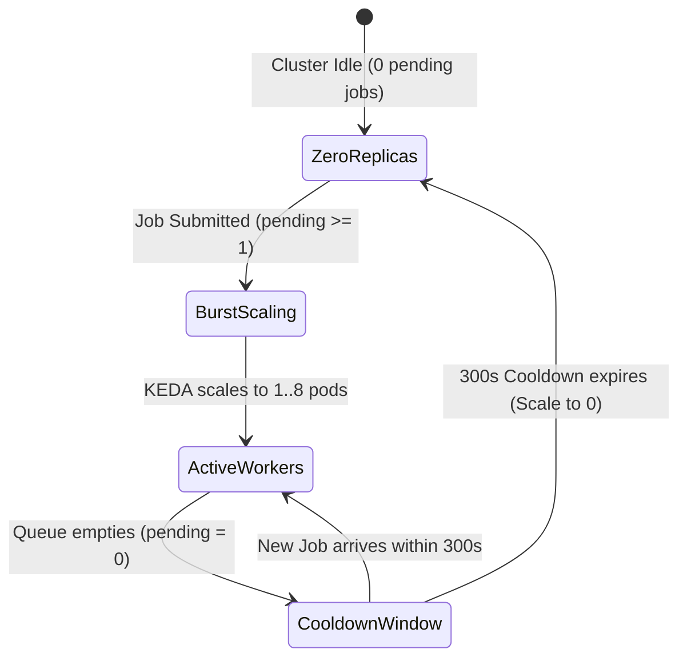

# Kubernetes Deployment & Operations Guide

This guide covers deploying, operating, and autoscaling `whisper-k8s` in a production Kubernetes cluster.

---

## 1. Prerequisites

Before deploying `whisper-k8s`, ensure your cluster meets the following requirements:

1. **Kubernetes Version**: 1.24 or newer.
2. **Shared Storage Provisioner**: A StorageClass supporting `ReadWriteMany` (RWX) access mode (e.g. NFS, AWS EFS CSI, Azure Files CSI, CephFS, or local hostpath for single-node development). Both the API bridge and worker pods mount `/data` simultaneously.
3. **NVIDIA GPU Operator** *(Optional for GPU acceleration)*: Required if running GPU worker pods with NVIDIA CUDA acceleration.
4. **KEDA Operator** *(Optional for autoscaling)*: Version 2.10+ required for event-driven scale-to-zero autoscaling based on task queue depth.

---

## 2. Manifest Directory Structure

All Kubernetes resources are located in the [`k8s_scripts/`](../k8s_scripts/) directory:

```text
k8s_scripts/
  ├── kustomization.yaml           # Root Kustomize resource manifest
  ├── rbac-bridge.yaml             # ServiceAccount, ClusterRole, RoleBinding
  ├── pv.yaml                      # PersistentVolume definition (RWX /data)
  ├── pvc.yaml                     # PersistentVolumeClaim (whisper-data)
  ├── gpu-timeslicing.yaml         # NVIDIA GPU time-slicing ConfigMap profiles
  ├── bridge.yaml                  # FastAPI Bridge Deployment & ClusterIP Service
  ├── model-preload-job.yaml       # Batch Job pre-downloading model weights to PVC
  ├── worker-deployment.yaml       # Warm Worker Pool Deployment (SERVICE=pool_worker)
  └── worker-keda-autoscaler.yaml  # KEDA ScaledObject (0 -> 8 replicas)
```

---

## 3. Step-by-Step Production Deployment

### Step 1: Deploy with Kustomize
Deploy the entire stack in the `whisper` namespace with a single command:

```bash
kubectl apply -k k8s_scripts/
```

### Step 2: Verify Namespace & Storage
Ensure the `whisper-data` PersistentVolumeClaim is bound:

```bash
kubectl get pvc -n whisper
```
*Expected Output:*
```text
NAME           STATUS   VOLUME         CAPACITY   ACCESS MODES   STORAGECLASS   AGE
whisper-data   Bound    whisper-pv     100Gi      RWX            standard       30s
```

### Step 3: Run the Model Preload Job
The model preload Job (`whisper-model-preload`) primes requested Whisper models directly onto `/data/models` on the shared PVC:

```bash
kubectl get jobs -n whisper
```

To tail the download progress:
```bash
kubectl logs -f job/whisper-model-preload -n whisper
```
*Expected Output:*
```text
[model-preloader] Downloading OpenAI Whisper weights for 'base' to /data/models/whisper
[model-preloader] Downloading Faster-Whisper weights for 'base' to /data/models/huggingface
[model-preloader] All requested models preloaded successfully!
```

### Step 4: Verify Bridge & Workers
Check that the Bridge pod is ready and healthy:

```bash
kubectl get pods -n whisper
```
*Expected Output:*
```text
NAME                                  READY   STATUS    RESTARTS   AGE
whisper-bridge-7f69848dc6-b5xk2       1/1     Running   0          2m
whisper-worker-pool-84729f95f-9k2j1   1/1     Running   0          2m
whisper-worker-pool-84729f95f-m4z8a   1/1     Running   0          2m
```

### Step 5: Test Bridge API Connectivity
Port-forward the bridge service to verify cluster connectivity:

```bash
kubectl port-forward svc/whisper-bridge 8080:8080 -n whisper
```

In another terminal, test the `/health` endpoint:
```bash
curl http://localhost:8080/health
```

---

## 4. NVIDIA GPU Time-Slicing Configuration

To enable multiple worker pods to share a single physical GPU, apply the time-slicing profiles from `k8s_scripts/gpu-timeslicing.yaml`:

```yaml
apiVersion: v1
kind: ConfigMap
metadata:
  name: whisper-gpu-timeslicing
  namespace: gpu-operator
data:
  time-slicing-4x: |-
    version: v1
    flags:
      migStrategy: none
    sharing:
      timeSlicing:
        resources:
          - name: nvidia.com/gpu
            replicas: 4
```

To bind this profile to your worker node pool, patch the NVIDIA ClusterPolicy:
```bash
kubectl patch clusterpolicy default --type merge \
  -p '{"spec": {"devicePlugin": {"config": {"name": "whisper-gpu-timeslicing", "default": "time-slicing-4x"}}}}'
```
Each worker pod can now request `nvidia.com/gpu: "1"` while sharing the physical GPU with up to 3 other pods.

---

## 5. KEDA Scale-to-Zero Autoscaler

`k8s_scripts/worker-keda-autoscaler.yaml` defines a KEDA `ScaledObject` that manages the `whisper-worker-pool` deployment:

```yaml
apiVersion: keda.sh/v1alpha1
kind: ScaledObject
metadata:
  name: whisper-worker-autoscaler
  namespace: whisper
  labels:
    app: whisper-worker-pool
spec:
  scaleTargetRef:
    apiVersion: apps/v1
    kind: Deployment
    name: whisper-worker-pool
  minReplicaCount: 0
  maxReplicaCount: 8
  pollingInterval: 15
  cooldownPeriod: 300
  triggers:
    - type: prometheus
      metadata:
        serverAddress: http://whisper-bridge.whisper.svc.cluster.local:8080/metrics
        metricName: whisper_queue_depth
        query: sum(whisper_queue_depth{queue="pending"})
        threshold: "2"
        activationThreshold: "1"
```

### Autoscaling Lifecycle


### Tuning Parameters
- **`minReplicaCount: 0`**: When the queue is empty for $>300\text{s}$, scales workers down to 0, completely freeing GPU VRAM and eliminating cloud GPU costs.
- **`activationThreshold: "1"`**: As soon as a single task enters `/data/queue/pending`, KEDA immediately wakes the deployment up to 1 replica.
- **`threshold: "2"`**: Scales out 1 additional pod replica for every 2 pending jobs in the queue (e.g. 5 pending jobs $\rightarrow$ 3 pods), up to `maxReplicaCount: 8`.
- **`cooldownPeriod: 300`**: Workers stay warm in memory for 5 minutes after finishing a batch, avoiding cold-start churn during intermittent workloads.

---

## 6. Operational Procedures & Troubleshooting

### Viewing Cluster Metrics
Prometheus scrapes the bridge at `http://whisper-bridge.whisper.svc.cluster.local:8080/metrics`.
To inspect real-time metrics manually:
```bash
kubectl exec -it deployment/whisper-bridge -n whisper -- curl -s http://localhost:8080/metrics
```

### Inspecting Worker Logs
Tail live worker logs to observe transcription progress:
```bash
kubectl logs -l app=whisper-worker-pool -n whisper -f --tail=100
```

### Common Issues & Mitigations

| Symptom | Cause | Solution |
| :--- | :--- | :--- |
| `OOMKilled` on Worker Pod | Whisper model exceeded container memory limit | Check `resources.limits.memory` in `worker-deployment.yaml`. Ensure at least 8Gi for `base`/`small`, or 16Gi for `large-v3`. |
| `CUDA out of memory` | Multiple processes allocated on the same GPU without limits | Set `CUDA_MEMORY_FRACTION=0.25` in `worker-deployment.yaml` and verify `COMPUTE_TYPE=int8_float16`. |
| `file not found under VIDEOS_DIR` | PVC not mounted correctly or path mismatch | Verify that the volume mount path is `/data` and files are placed in `/data/videos`. |
| KEDA does not scale pods | Bridge `/metrics` unreachable by KEDA operator | Ensure network policies permit traffic from the KEDA operator namespace to port `8080` of `whisper-bridge`. |
